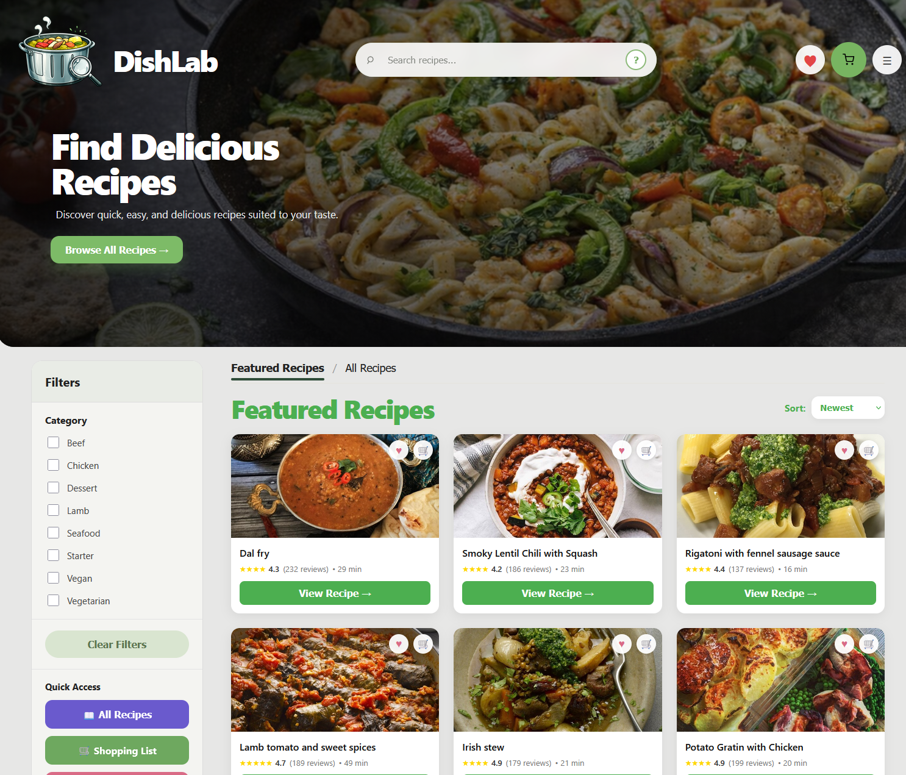
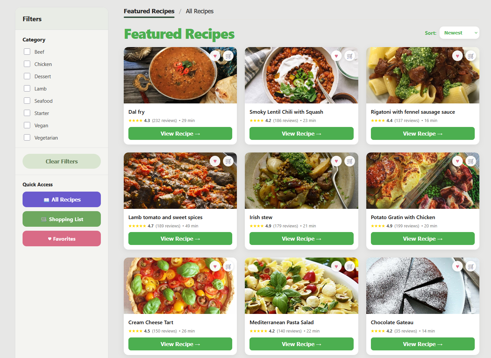
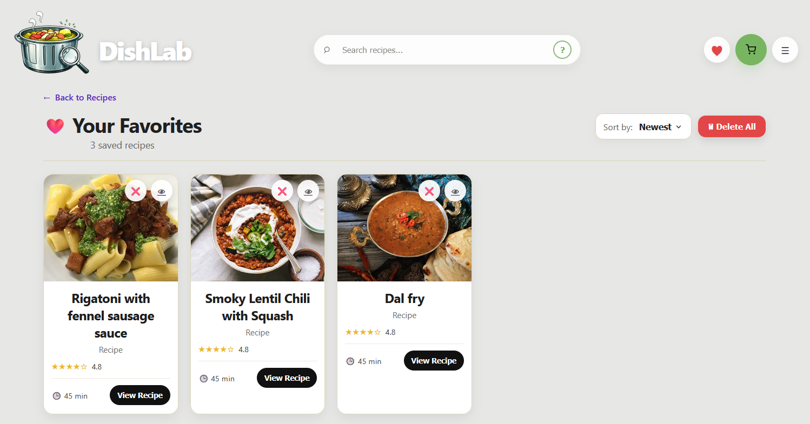
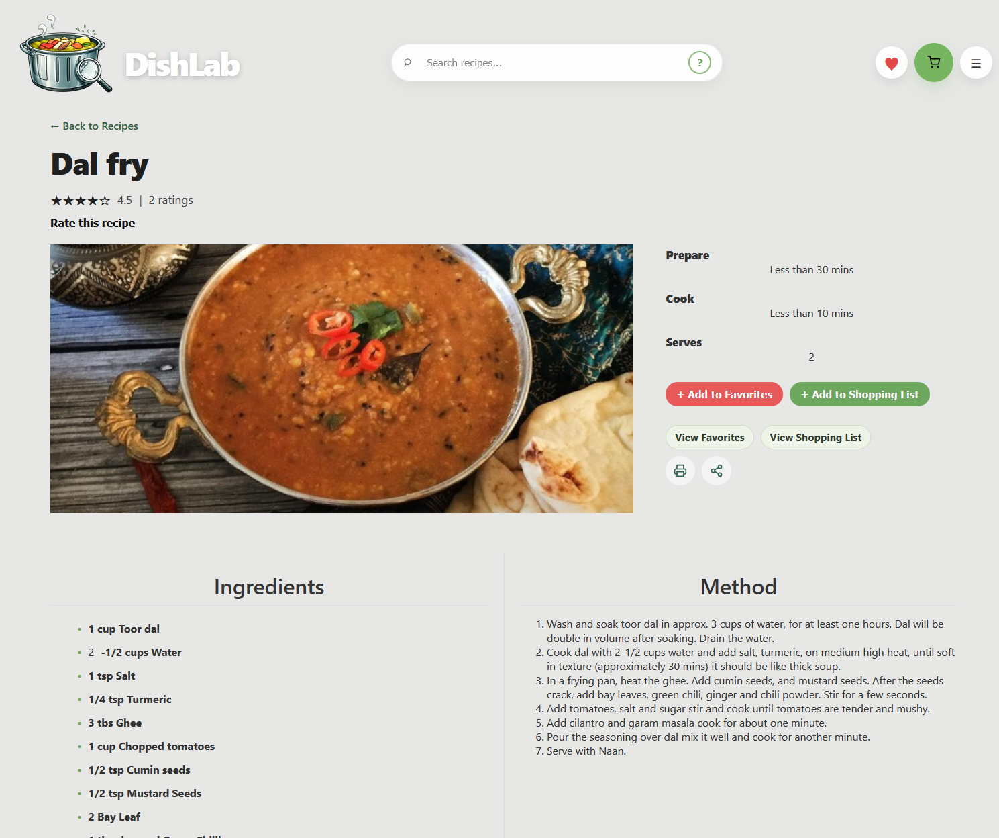

# 🍽️ RecipeApp

A full-stack recipe management application built with **React, Node.js, Express and MongoDB**.

RecipeApp allows users to manage recipes, save favourites and manage shopping-list items through a responsive web interface connected to a REST API.

This project demonstrates my practical experience building and integrating a full-stack application from frontend through to backend and database.

---

## 🚀 Features

* User authentication
* Create and manage recipes
* View individual recipes
* Save favourite recipes
* Manage shopping-list items
* Recipe categories
* User-specific data
* REST API integration
* Persistent database storage

---

## 🛠️ Tech Stack

**Frontend**

* React
* Vite
* JavaScript
* JSX
* CSS
* React Context

**Backend**

* Node.js
* Express
* REST API
* Middleware
* Controllers
* Routes

**Database**

* MongoDB
* MongoDB Atlas

**Deployment**

* Railway
* Vercel

**Tools**

* Git
* GitHub
* ESLint

---

## 🏗️ Architecture

The application is separated into frontend and backend applications.

```text
React / Vite
     ↓
REST API
     ↓
Node.js / Express
     ↓
MongoDB
```

The backend uses a structured approach with separate **controllers, routes, middleware, models and utilities**.

---

## 📸 Screenshots

### Recipe Dashboard



### Recipe Details



### Shopping List



### Favourites



> Screenshots show the application interface and key functionality.

---

## 🔧 Development & Problem Solving

During development I worked through a number of real-world full-stack issues, including:

* API `404` errors
* CORS configuration
* MongoDB duplicate-key errors
* Frontend/backend integration
* Route and parameter debugging
* Local and deployed environment configuration

These issues required tracing requests across the application from the React frontend through the Express API and into the database.

---

## 🌍 Deployment

The project has been developed and deployed using cloud services including:

* **MongoDB Atlas** for database hosting
* **Railway** for backend/deployment configuration
* **Vercel** for deployment

---

## 📚 What This Project Demonstrates

This project demonstrates my ability to:

* Build a React frontend
* Develop a Node.js/Express backend
* Design and consume REST APIs
* Work with MongoDB
* Implement user authentication
* Connect frontend, backend and database layers
* Debug full-stack issues
* Work with cloud deployment
* Use Git and GitHub for version control

---

## 🎯 Project Status

**Portfolio project — active development**

RecipeApp is part of my full-stack development portfolio and demonstrates my progression from frontend development into building complete web applications.

---

## 👩‍💻 About Me

I'm a self-taught full-stack web developer with a background in project management and telecommunications.

I'm currently focused on developing my professional skills across **React, JavaScript, Node.js, APIs, databases and cloud technologies**.

---

## 🔗 Links

**Live Demo:** [Add your deployed application link]

**GitHub:** [Add your repository link]
